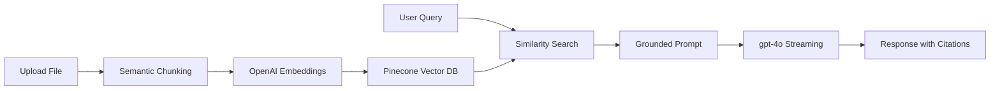

# Company Knowledge AI - Enterprise RAG Platform

Welcome to the **Company Knowledge AI** repository. This is a full-stack, production-grade Retrieval-Augmented Generation (RAG) platform designed to let companies interact with their institutional knowledge through a premium AI interface.

## 🏗️ Project Architecture

The system is split into two main components:

### 1. [Backend (Node.js & AI Core)](./backend)
The "Engine" of the platform. It handles:
- **Semantic Ingestion**: Parsing PDF/DOCX/TXT files into vector embeddings.
- **Vector Search**: Real-time retrieval using **Pinecone**.
- **AI Orchestration**: Grounded chat responses via **OpenAI gpt-4o** with inline citations.
- **Data Persistence**: MongoDB for metadata and session management.

### 2. [Frontend (Next.js 15 & Tailwind 4)](./frontend)
The "Experience" layer. It features:
- **Interactive Chat**: Real-time streaming interface with source citations.
- **Knowledge Hub**: Simple drag-and-drop document manager.
- **Responsive Design**: Premium mobile-first UI with dark mode support.
- **Token Analytics**: Live monitoring of AI resource consumption.

---

## 🚀 Quick Start Guide

To get the entire platform up and running locally, follow these steps:

### 1. Setup Backend
```bash
cd backend
npm install
# Configure .env (see backend/README.md)
npm run dev
```

### 2. Setup Frontend
```bash
cd frontend
pnpm install
# Configure .env.local (see frontend/README.md)
pnpm dev
```

The application will be available at **http://localhost:3000**.

---

## 🧠 The RAG Pipeline



## ⚙️ Core Technologies

- **Frontend**: Next.js 15, Tailwind CSS 4.0, Lucide, Framer Motion.
- **Backend**: Node.js, Express, TypeScript, Mongoose.
- **AI/ML**: OpenAI API (Embeddings & Completion), LangChain.
- **Infrastructure**: Pinecone (Vector Store), MongoDB (Metadata).

Refer to the individual [Frontend](./frontend/README.md) and [Backend](./backend/README.md) documentation for deeper technical details.
