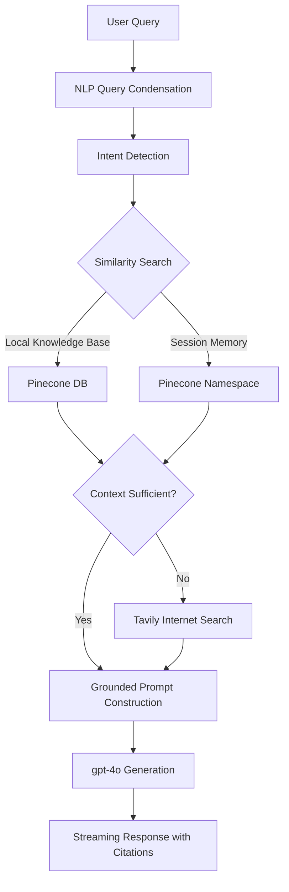

# Company Knowledge AI - Enterprise RAG Platform

Welcome to the **Company Knowledge AI** repository. This is a full-stack, production-grade Retrieval-Augmented Generation (RAG) platform designed to let companies interact with their institutional knowledge through a premium AI interface.

## 🏗️ Project Architecture

The system is split into two main components:

### 1. [Backend (Node.js & AI Core)](./backend)
The "Engine" of the platform. It handles:
- **Semantic Ingestion**: Parsing PDF/DOCX/TXT/SQL files into vector embeddings.
- **NLP-Driven Retrieval**: Uses **Query Condensation** (NLP) and **Intent Detection** to handle complex follow-up questions and aggregations.
- **Context-Aware Memory**: Implements session-specific vector memory for coherent multi-turn conversations.
- **Hybrid RAG & Internet Search**: Integrates **Tavily Search** for real-time internet fallback if internal knowledge is insufficient.
- **Vector Search**: High-performance retrieval using **Pinecone** namespaces for session memory.
- **AI Orchestration**: Grounded chat responses via **OpenAI gpt-4o** with accurate inline citations (including URLs for web results).

### 2. [Frontend (Next.js 15 & Tailwind 4)](./frontend)
The "Experience" layer. It features:
- **Interactive Chat**: Real-time streaming interface with source citations.
- **Knowledge Hub**: Simple drag-and-drop document manager.
- **Responsive Design**: Premium mobile-first UI with dark mode support.
- **Token Analytics**: Live monitoring of AI resource consumption.

### 3. [Visualizer (Python & Nomic Atlas)](https://www.google.com/search?q=./visualize.py)

The "Insight" layer. A standalone utility to:

* **Cluster Analysis**: Visualize the high-dimensional vector space of your Pinecone index.
* **Topic Modeling**: Automatically categorize company documents into visual themes.

---

## 🚀 Quick Start Guide

To get the entire platform up and running locally, follow these steps:

### 1. Setup Backend
```bash
cd backend
npm install
# Configure .env (see backend/README.md)
npm run dev
```

### 2. Setup Frontend
```bash
cd frontend
pnpm install
# Configure .env.local (see frontend/README.md)
pnpm dev
```

The application will be available at **http://localhost:3000**.

### 3. Run the Knowledge Visualizer

To generate a 2D interactive map of your Pinecone vectors:

```bash
# 1. Create and activate a virtual environment
python -m venv venv
source venv/bin/activate  # On Windows: venv\Scripts\activate

# 2. Install dependencies
pip install pinecone nomic numpy

# 3. Run the visualizer
python visualize.py

```

---

## 📊 Knowledge Map Preview

We use **Nomic Atlas** to project our 1536-dimensional embeddings into a browsable 2D map. This allows administrators to see "dead zones" in knowledge or over-represented topics.

> [!TIP]
> **Live Interactive Map:** [View Company Knowledge Map](https://atlas.nomic.ai/data/rahulbhatt3578/pinecone-map-company-knowledge/map/3c488703-559c-467b-8f46-1402174b983f#mTij)

---

## 🧠 The RAG Pipeline



## ⚙️ Core Technologies

- **Frontend**: Next.js 15, Tailwind CSS 4.0, Lucide, Framer Motion.
- **Backend**: Node.js, Express, TypeScript, Mongoose.
- **AI/ML**: OpenAI API (Embeddings & Completion GPT-4o), **Tavily Search** (Internet Retrieval), LangChain (Text Splitters).
- **Infrastructure**: Pinecone (Vector Store), MongoDB (Persistence), Axios.

Refer to the individual [Frontend](./frontend/README.md) and [Backend](./backend/README.md) documentation for deeper technical details.
